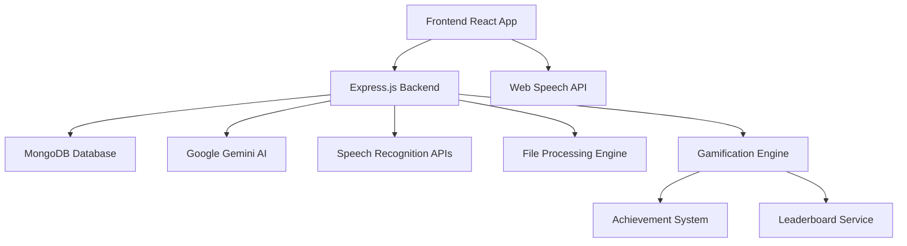

# Samvaad

<div align="center">

**The Ultimate AI-Powered Multilingual Debate Platform**

*Empowering debaters worldwide with intelligent adjudication, real-time translation, and competitive debate simulation*

[](https://choosealicense.com/licenses/mit/)
[](https://nodejs.org/)
[](https://reactjs.org/)
[](https://mongodb.com/)

[Quick Start](#quick-start) • [Features](#features) • [Architecture](#architecture) • [Usage](#usage) • [Contributing](#contributing)

</div>

---

## Overview

**Samvaad** is a comprehensive AI-powered debate platform that revolutionizes competitive debating through:

- **Intelligent AI Adjudication** with detailed feedback and clash analysis
- **Real-time Speech Recognition** and multilingual support
- **Multiple Debate Formats** (Asian Parliamentary, British Parliamentary, World Schools)
- **Advanced Analytics** and performance tracking
- **Gamified Learning Experience** with achievements and leaderboards
- **Cross-lingual Accessibility** for global participation

---

## Features

### Debate Management & Formats
- **Asian Parliamentary (AP)** - 6 speakers + reply speeches
- **British Parliamentary (BP)** - 8 speakers across 4 teams
- **World Schools (WS)** - 6 speakers + reply speeches
- **Custom Format Support** with flexible speaker configurations
- **Motion Library** with curated debate topics
- **Session Management** with real-time status tracking

### AI-Powered Adjudication
- **Comprehensive Scoring** (Matter, Manner, Method)
- **Chain of Thought Analysis** with clash identification
- **Speaker-by-Speaker Feedback** with role fulfillment analysis
- **Team Rankings** with detailed justifications
- **Reply Speech Evaluation** with specialized criteria
- **Timestamped Comments** for granular feedback
- **Custom Adjudication** from uploaded transcripts (PDF/TXT)

### Speech & Audio Features
- **Live Speech Recognition** with Web Speech API
- **Real-time Transcription** during debates
- **Audio Playback** with text-to-speech synthesis
- **Microphone Controls** with visual feedback
- **Timer Integration** for speech time limits

### AI Debate Simulation
- **One-on-One AI Debates** with dynamic responses
- **Rebuttal Training** with personalized feedback
- **AI Speech Generation** contextual to debate flow
- **Adaptive AI Responses** based on user arguments
- **Performance Analytics** for skill improvement

### Gamification & Engagement
- **Achievement System** with unlockable badges and milestones
- **Experience Points (XP)** earned through participation and performance
- **Skill Level Progression** from Novice to Expert debater
- **Weekly Challenges** with rotating debate topics
- **Leaderboards** for different categories (accuracy, improvement, consistency)
- **Debate Streaks** tracking consecutive days of practice
- **Performance Badges** for specific accomplishments:
  - "Master Rebuttalist" - Excel in counter-arguments
  - "Clash Champion" - Identify key debate points
  - "Eloquent Speaker" - High manner scores
  - "Logic Lord" - Outstanding matter scores
  - "Methodology Master" - Perfect method execution
- **Daily Practice Rewards** encouraging consistent engagement
- **Tournament Mode** with bracket-style competitions
- **Progress Visualization** with skill trees and advancement paths

### Analytics & Tracking
- **Detailed Performance Metrics** (Clarity, Relevance, Persuasiveness)
- **Progress Tracking** across multiple sessions
- **Strengths & Improvement Areas** identification
- **Historical Data** with trend analysis
- **Export Capabilities** for transcripts and results
- **Comparative Analysis** against personal bests and community averages

### User Experience
- **Responsive Design** optimized for all devices
- **Dark Mode Interface** with modern aesthetics
- **Intuitive Navigation** with role-based access
- **Real-time Updates** with live session status
- **Accessibility Features** with keyboard navigation

### Technical Features
- **File Upload Support** (PDF/TXT transcripts)
- **RESTful API** with comprehensive endpoints
- **Database Integration** with MongoDB
- **Error Handling** with graceful fallbacks
- **Rate Limiting** and API protection
- **Scalable Architecture** with modular design

---

## Architecture

### System Components



### Tech Stack

| Layer | Technology | Purpose |
|-------|------------|---------|
| **Frontend** | React 18, Tailwind CSS, Lucide Icons | Modern, responsive UI |
| **Backend** | Node.js, Express.js (ESM) | RESTful API server |
| **Database** | MongoDB, Mongoose ODM | Data persistence |
| **AI Services** | Google Gemini 2.0 Flash | Adjudication & speech generation |
| **File Processing** | PDF-Parse, Multer | Document handling |
| **Authentication** | JWT, bcrypt | Secure user management |
| **Gamification** | Custom scoring algorithms | User engagement & progression |

---

## Quick Start

### Prerequisites
- Node.js 18+ and npm
- MongoDB (local or cloud)
- Google Gemini API key

### Installation

```bash
# Clone the repository
git clone https://github.com/priyanshuraj27/samvaad.git
cd samvaad

# Backend setup
cd backend
npm install
cp .env.example .env
# Configure your environment variables
npm run dev

# Frontend setup (new terminal)
cd ../frontend
npm install
npm run dev
```

### Environment Variables

```env
# Backend (.env)
MONGODB_URI=mongodb://localhost:27017/samvaad
GEMINI_API_KEY=your_gemini_api_key
JWT_SECRET=your_jwt_secret
PORT=5000

# Frontend
VITE_API_URL=http://localhost:5000/api
```

---

## Usage

### Quick Debate Flow

1. **Create Session** → Choose format (AP/BP/WS) and motion
2. **Join Debate** → Select your role and team
3. **Live Interaction** → Speak with real-time transcription
4. **AI Adjudication** → Get instant feedback and scores
5. **Review Results** → Analyze performance and download transcripts
6. **Earn Rewards** → Gain XP, unlock achievements, and climb leaderboards

### Gamification Features

#### Achievement System
- **Daily Debater** - Complete 7 consecutive days of practice
- **Perfect Score** - Achieve maximum scores in all three categories
- **Clash Master** - Successfully identify and address 10+ key clashes
- **Improvement Champion** - Show consistent progress over 30 days
- **Community Contributor** - Upload 5+ custom transcript adjudications

#### Progression System
```
Novice (0-100 XP) → Apprentice (101-300 XP) → Skilled (301-600 XP) → 
Expert (601-1000 XP) → Master (1001-1500 XP) → Grand Master (1500+ XP)
```

#### Weekly Challenges
- **Monday Motions** - Practice with trending topics
- **Wisdom Wednesday** - Focus on argument depth and research
- **Friday Finals** - Participate in mini-tournaments

### AI Training Modes

#### One-on-One Debate
```javascript
// Navigate to /one-v-one-debate
// Choose your side (Government/Opposition)
// Engage in real-time debate with AI
// Earn XP based on performance metrics
```

#### Rebuttal Trainer
```javascript
// Navigate to /rebuttal-trainer
// Input topic → Get AI argument → Practice rebuttal
// Receive detailed feedback on performance
// Complete challenges for bonus XP
```

### Custom Adjudication
```javascript
// Upload transcript files (PDF/TXT)
// Get comprehensive AI adjudication
// Access via /custom-adjudicator
// Contribute to community knowledge base
```

---

## Screenshots

<div align="center">

### Dashboard with Gamification


### Live Debate Interface


### Achievement & Progress Tracking


### AI Adjudication Results


</div>

---

## API Reference

### Core Endpoints

| Method | Endpoint | Description |
|--------|----------|-------------|
| `POST` | `/api/sessions` | Create new debate session |
| `GET` | `/api/sessions/:id` | Get session details |
| `POST` | `/api/adjudications` | Generate AI adjudication |
| `POST` | `/api/adjudications/upload` | Custom adjudication from file |
| `GET` | `/api/adjudications/:id` | Get adjudication results |
| `GET` | `/api/users/achievements` | Get user achievements |
| `GET` | `/api/leaderboard` | Get community leaderboard |
| `POST` | `/api/users/progress` | Update user progress |

### Gamification Endpoints

| Method | Endpoint | Description |
|--------|----------|-------------|
| `GET` | `/api/achievements` | List all available achievements |
| `POST` | `/api/achievements/unlock` | Unlock user achievement |
| `GET` | `/api/leaderboard/:type` | Get specific leaderboard |
| `GET` | `/api/challenges/weekly` | Get current weekly challenges |
| `POST` | `/api/progress/update` | Update user XP and level |

### Authentication
```bash
# Register user
POST /api/auth/register
Content-Type: application/json
{
  "username": "debater123",
  "email": "user@example.com",
  "password": "securepassword"
}

# Login
POST /api/auth/login
Authorization: Bearer <token>
```

---

## Advanced Features

### AI Adjudication Engine
- **Multi-stage Analysis**: Separate prompts for scoring, clash analysis, and detailed feedback
- **Format-aware Evaluation**: Adapts criteria based on debate format
- **Contextual Understanding**: Considers speaker roles and debate flow

### Real-time Debate Simulation
- **Dynamic Speech Generation**: AI adapts responses based on previous arguments
- **Role-based Behavior**: Different AI personalities for different speaker positions
- **Clash Detection**: Identifies key points of contention automatically

### Performance Analytics
- **Skill Progression Tracking**: Monitor improvement over time
- **Weakness Identification**: Targeted feedback for specific areas
- **Comparative Analysis**: Benchmark against previous performances
- **Community Insights**: Compare progress with similar-level debaters

### Gamification Engine
- **Dynamic XP Calculation**: Based on performance, improvement, and consistency
- **Achievement Triggers**: Automated detection of milestone completions
- **Leaderboard Management**: Real-time ranking updates across multiple categories
- **Challenge Generation**: Algorithm-driven weekly challenges based on user data

---

## Development

### Project Structure
```
samvaad/
├── frontend/
│   ├── src/
│   │   ├── components/     # Reusable UI components
│   │   ├── screen/         # Page components
│   │   ├── utils/          # Helper functions
│   │   ├── gamification/   # Achievement & progress components
│   │   └── App.jsx         # Main application
├── backend/
│   ├── src/
│   │   ├── controllers/    # Business logic
│   │   ├── models/         # Database schemas
│   │   ├── routes/         # API endpoints
│   │   ├── middleware/     # Authentication, validation
│   │   ├── gamification/   # Achievement & scoring logic
│   │   └── utils/          # Helper utilities
└── docs/                   # Documentation
```

### Contributing Guidelines
1. Fork the repository
2. Create feature branch (`git checkout -b feature/amazing-feature`)
3. Commit changes (`git commit -m 'Add amazing feature'`)
4. Push to branch (`git push origin feature/amazing-feature`)
5. Open Pull Request

---

## Testing

```bash
# Backend tests
cd backend
npm run dev

# Frontend tests
cd frontend
npm run dev


```

---

## Deployment

### Docker Deployment
```bash
# Build and run with Docker Compose
docker-compose up -d

# Scale services
docker-compose up -d --scale backend=3
```

### Production Setup
```bash
# Backend production build
npm run build
npm start

# Frontend production build
npm run build
```

---

## Contributing

We welcome contributions! Please see our [Contributing Guide](CONTRIBUTING.md) for details.

### Ways to Contribute
- **Bug Reports** - Help us identify and fix issues
- **Feature Requests** - Suggest new functionality
- **Documentation** - Improve guides and API docs
- **Testing** - Add test coverage
- **Translations** - Support more languages
- **Gamification Ideas** - Suggest new achievements and challenges

---

## Contact & Support

### Development Team

**Priyanshu Raj**
- **GitHub**: [@priyanshuraj27](https://github.com/priyanshuraj27)
- **LinkedIn**: [priyanshu-raj-iiitn](https://www.linkedin.com/in/priyanshu-raj-iiitn/)

**Bhuvan Goel**
- **GitHub**: [@bhuvangoel04](https://github.com/bhuvangoel04)
- **LinkedIn**: [bhuvan-goel-8611b7287](https://www.linkedin.com/in/bhuvan-goel-8611b7287/)

### Community
- **Discussions**: [GitHub Discussions](https://github.com/priyanshuraj27/samvaad/discussions)
- **Issues**: [Report bugs](https://github.com/priyanshuraj27/samvaad/issues)

---

## License

This project is licensed under the MIT License - see the [LICENSE](LICENSE) file for details.

---

## Acknowledgments

- **Google Gemini Team** for providing advanced AI capabilities
- **React Community** for the amazing ecosystem
- **MongoDB** for reliable data storage
---

<div align="center">

**Star this repository if you find it helpful!**

*Built with passion for the global debating community*

[](https://github.com/priyanshuraj27/samvaad)
[](https://github.com/priyanshuraj27/samvaad/fork)

</div>
